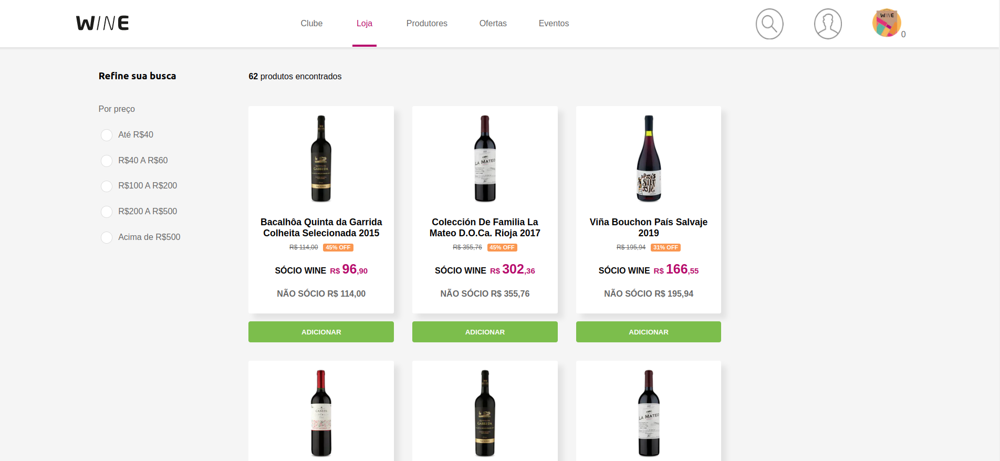
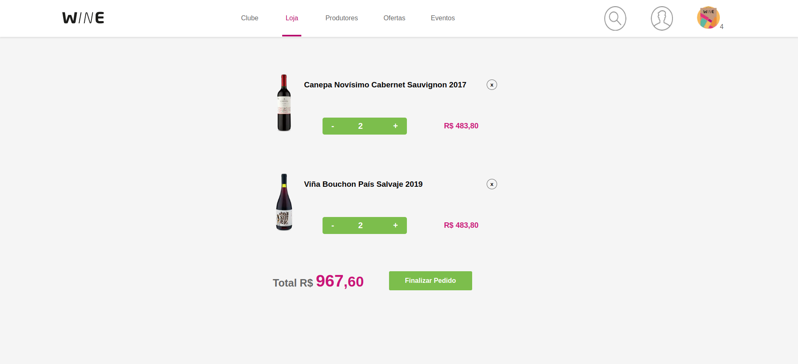

# Desafio - WINE
Desafio é desenvolver uma aplicação Fron-end de um E-Commerce de vinhos.

## Stacks ultilizadas:

### Frontend:
  - Foi utilizado o `TypeScript`.
  - Foi utilizado o `Reactjs`.
  - Foi utilizado o `Nextjs`.
  - Foi utilizado o `styled-components`.
  - Foi utilizado o `Redux`.
  - Componente Funcional.
  - Foi utilizado hooks.
  
## Deploy Vercel: https://wine-beryl.vercel.app/

## Screenshots:





### Desafios:
 - Foi a primeira vez que ultilizo TypeScript no front, Nextjs e styled-components.
 Optei por usar Redux, por ser o manipulador de estado que a Wine ultiliza,
 tive muitos problemas com tipagem, além de nunca ter usado Nextjs e styled-components,
 então tive que aprender essas ferramentas enquanto fazia o projeto.
 Projeto está com um erro quando da reload na pagina executando local, o erro não acontece
 no Vercel, estou trabalhando nele.
 
## **Requisitos:**
 - Só consegui trabalhar no projeto 2 dias, e por conta do tempo não consegui finalizar
 todos requisitos.
 
 - [x] - Catálogo de produtos com paginação
 - [x] Filtragem produtos por preço
 - [x] Busca por nome do produto
 - [x] Carrrinho salvo no localstorage
 - [x] Adicionar e remover produtos do carrinho
 - [x] CSS com styled-components
 - [ ] CSS com styled-components - responsivo(mobile)
 - [ ] Testes

##### Após faazer o Download do projeto:

```
npm i
npm run dev
```
